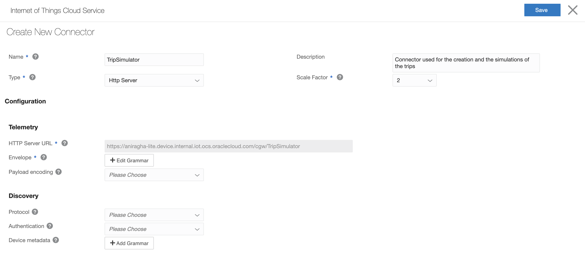
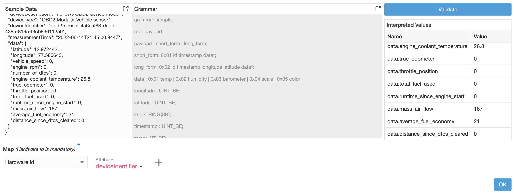
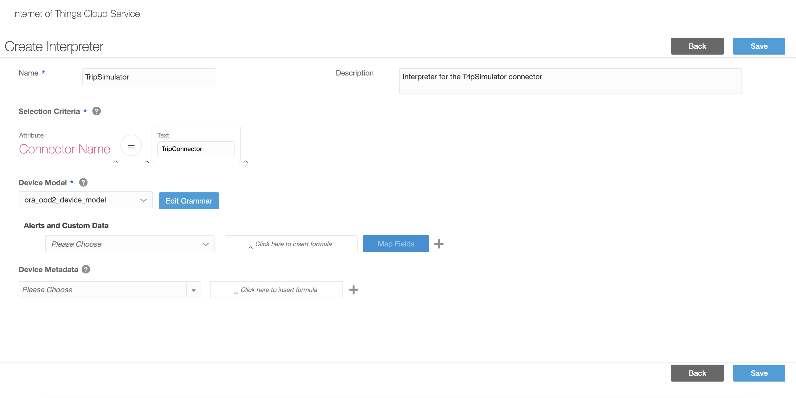
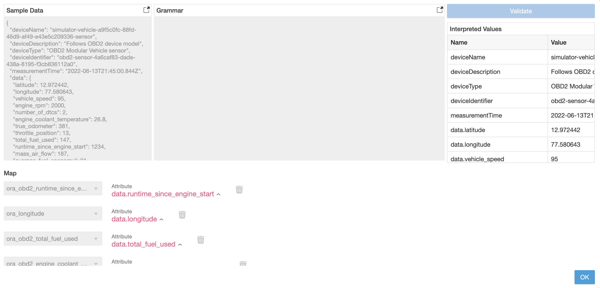

# Trip Simulator

Trip simulator, as part of the Oracle SCM - IoT division creates instances in the server instance and simulates a given number of trips with random sources, destinations and stops for a real UX.

## Getting started

1. Create a device model by running the [Device model](src/deviceModel/DeviceModelAPIClient.java) -> createDefaultEquipment to create the device model on the IoT server instance.
2. In the IoT server instance, head to the `Devices -> Connectors` section in the dashboard drawer.
3. Click on the icon to add a new connector and set the type to `Http server`. While creating, add the following grammar by copying and pasting the below text into the Telemetry->envelope property. Finally, click on validate and add a map between hardwareId and the deviceIdentifier as shown in the images below before creating the connector.



```json
{
  "deviceName": "simulator-vehicle-a9f5c0fc-88fd-46d9-af49-e43e5c209336-sensor",
  "deviceDescription": "Follows OBD2 device model",
  "deviceType": "OBD2 Modular Vehicle sensor",
  "deviceIdentifier": "obd2-sensor-4a6caf83-dade-438a-8195-f3cb836112a0",
  "measurementTime": "2022-06-14T21:45:00.844Z",
  "data": {
    "latitude": 12.972442,
    "longitude": 77.580643,
    "vehicle_speed": 0,
    "engine_rpm": 0,
    "number_of_dtcs": 0,
    "engine_coolant_temperature": 26.8,
    "true_odometer": 0,
    "throttle_position": 0,
    "total_fuel_used": 0,
    "runtime_since_engine_start": 0,
    "mass_air_flow": 187,
    "average_fuel_economy": 21,
    "distance_since_dtcs_cleared": 0
  }
}
```



3. Now head into the `Devices -> Interpreters` to create a data interpreter for the given connector. Set the selection criteria to `Connector name = {connectorName, in our case TripSimulator}` and select the **ora_obd2_device_model** device model. Lastly, in the add grammar section, paste the above payload example for the data and add maps to the corresponding obd2 data properties similar to the image attached below.





> ℹ️ Please refer to the [official documentation](https://docs.oracle.com/en/cloud/paas/iot-cloud/iotgs/create-and-manage-connectors.html) for additional assistance.

4. Create a connector and interpreter for the equipment device model in a similar way. The payload for equipment device model is
```json
{
  "deviceName": "simulator-equipment-a9f5c0fc-88fd-46d9-af49-e43e5c209336-sensor",
  "deviceDescription": "Follows ORA Equipment model",
  "deviceType": "Modular Equipment sensor",
  "deviceIdentifier": "equipment-sensor-4a6caf83-dade-438a-8195-f3cb836112a0",
  "measurementTime": "2022-06-14T21:45:00.844Z",
  "data": {
    "latitude": 13.123,
    "longitude": 70.123,
    "tilt": 12.3,
    "light": 23.4,
    "temperature": 34.5,
    "pressure": 1.2,
    "humidity": 86,
    "shock": 10.1,
    "ambient_temperature": 25.6,
    "tamper_detection": 14.3
  }
}
```
5. Set the proxy settings to the following configuration while connected to the oracle VPN
```
-Dhttp.proxyHost=www-proxy.us.oracle.com -Dhttps.proxyHost=www-proxy.us.oracle.com -Dhttp.proxyPort=80 -Dhttps.proxyPort=80 -Dhttp.nonProxyHosts="localhost|127.0.0.1|*.oraclecorp.com|*.us.oracle.com|*.internal.iot.ocs.oraclecloud.com" 
```
6. Go to [TripSimulator](src/simulation/TripSimulator.java) and set the global parameters. 
7. Run the simulation similar to the example at [Main](src/Main.java).

### Dependencies

1. HTTPClient (v4.5.13)
2. HTTPCore (v4.4.15)
3. Commons-logging (v1.2)
4. Jackson-Core (v2.13.3)
5. Jackson-databind (v0.4.24)
6. Jackson-annotations (v2.13.3)
7. Annotations (v20.1.0)
8. Testng (v7.6.0)
9. Jcommander (v1.48)
10. Slf4j-api (v1.7.36)
11. Logback-classic (v1.2.11)
12. Logback-core (v1.2.11)
13. Univocity-parsers (v2.9.1)

All dependencies can be installed manually from [maven repository](https://mvnrepository.com/) or using the following xml (pom) file  

```xml
<dependencies>
    <!-- https://mvnrepository.com/artifact/org.apache.httpcomponents/httpclient -->
    <dependency>
        <groupId>org.apache.httpcomponents</groupId>
        <artifactId>httpclient</artifactId>
        <version>4.5.13</version>
    </dependency>

    <!-- https://mvnrepository.com/artifact/org.apache.httpcomponents/httpcore -->
    <dependency>
        <groupId>org.apache.httpcomponents</groupId>
        <artifactId>httpcore</artifactId>
        <version>4.4.15</version>
    </dependency>

    <!-- https://mvnrepository.com/artifact/commons-logging/commons-logging -->
    <dependency>
        <groupId>commons-logging</groupId>
        <artifactId>commons-logging</artifactId>
        <version>1.2</version>
    </dependency>

    <!-- https://mvnrepository.com/artifact/com.fasterxml.jackson.core/jackson-core -->
    <dependency>
        <groupId>com.fasterxml.jackson.core</groupId>
        <artifactId>jackson-core</artifactId>
        <version>2.13.3</version>
    </dependency>

    <!-- https://mvnrepository.com/artifact/com.fasterxml.jackson.core/jackson-databind -->
    <dependency>
        <groupId>com.fasterxml.jackson.core</groupId>
        <artifactId>jackson-databind</artifactId>
        <version>2.13.3</version>
    </dependency>

    <!-- https://mvnrepository.com/artifact/com.fasterxml.jackson.core/jackson-annotations -->
    <dependency>
        <groupId>com.fasterxml.jackson.core</groupId>
        <artifactId>jackson-annotations</artifactId>
        <version>2.13.3</version>
    </dependency>

    <!-- https://mvnrepository.com/artifact/org.jetbrains/annotations -->
    <dependency>
        <groupId>org.jetbrains</groupId>
        <artifactId>annotations</artifactId>
        <version>20.1.0</version>
    </dependency>

    <!-- https://mvnrepository.com/artifact/org.testng/testng -->
    <dependency>
        <groupId>org.testng</groupId>
        <artifactId>testng</artifactId>
        <version>7.6.0</version>
        <scope>test</scope>
    </dependency>

    <!-- https://mvnrepository.com/artifact/com.beust/jcommander -->
    <dependency>
        <groupId>com.beust</groupId>
        <artifactId>jcommander</artifactId>
        <version>1.48</version>
    </dependency>

    <!-- https://mvnrepository.com/artifact/org.slf4j/slf4j-api -->
    <dependency>
        <groupId>org.slf4j</groupId>
        <artifactId>slf4j-api</artifactId>
        <version>1.7.36</version>
    </dependency>

    <!-- https://mvnrepository.com/artifact/ch.qos.logback/logback-classic -->
    <dependency>
        <groupId>ch.qos.logback</groupId>
        <artifactId>logback-classic</artifactId>
        <version>1.2.11</version>
        <scope>test</scope>
    </dependency>


    <!-- https://mvnrepository.com/artifact/ch.qos.logback/logback-core -->
    <dependency>
        <groupId>ch.qos.logback</groupId>
        <artifactId>logback-core</artifactId>
        <version>1.2.11</version>
    </dependency>
    
</dependencies>
```

## Simulation

### Instance creation

One instance has the fixed [data trip model](src/simulation/models/TripModel.java) and uses a separate thread to simulate one vehicle movement along with posting payloads for the vehicle at fixed intervals.

### Physics

The payload is sent after each report time in simulation, which operates on a fixed report time. Instead of employing route leg corners, the threads use variable sleep duration to keep pace with the predetermined interval and obtain precise geolocation. The vehicle is slowed to 40% for handling route corners (global parameter).


## API Clients

1. IoT server instance

API calls are made to the IoT server instance to create trip instances & corresponding prerequisites for the simulation. API calls are made to the following API REST endpoints

- [Device model](https://docs.oracle.com/en/cloud/paas/iot-cloud/iotrq/api-iot-device-models.html)
- [Device](https://docs.oracle.com/en/cloud/paas/iot-cloud/iotrq/api-iot-device-resource.html)
- [Trips](https://docs.oracle.com/en/cloud/saas/iot-fleet-cloud/rest-api/api-trip-management.html)
- [Vehicle type](https://docs.oracle.com/en/cloud/saas/iot-fleet-cloud/rest-api/api-vehicle-type-management.html)
- [Vehicle](https://docs.oracle.com/en/cloud/saas/iot-fleet-cloud/rest-api/api-vehicle-management.html)
- [User](https://docs.oracle.com/en/cloud/saas/iot-fleet-cloud/iotfm/add-and-manage-users.html#GUID-5D39B63C-CF31-4C2C-9EF0-25B2DCEECB7F)
- Organization
- [Connectors](https://docs.oracle.com/en/cloud/paas/iot-cloud/iotgs/create-and-manage-connectors.html)

2. HERE Maps

API Calls are made to the [routing](https://developer.here.com/documentation/routing-api/dev_guide/index.html) and the [reverse geolocation](https://developer.here.com/documentation/geocoder/dev_guide/topics/resource-reverse-geocode.html) sections of the HERE maps API

## References

1. Distance calculations using geolocations - [StackExchange](https://stackoverflow.com/questions/3694380/calculating-distance-between-two-points-using-latitude-longitude)
2. Interpolation of geolocation & calculation of bearing - [StackExchange](https://stackoverflow.com/questions/38691611/java-interpolate-between-two-gps-points-with-a-speed)
3. CSV reading & parsing - [Baeldung](https://www.baeldung.com/java-csv-file-array)

## Further additions

1. Shipments
2. Alerts & incident posting
